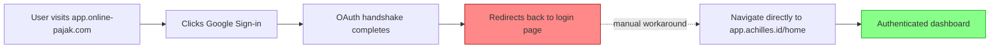
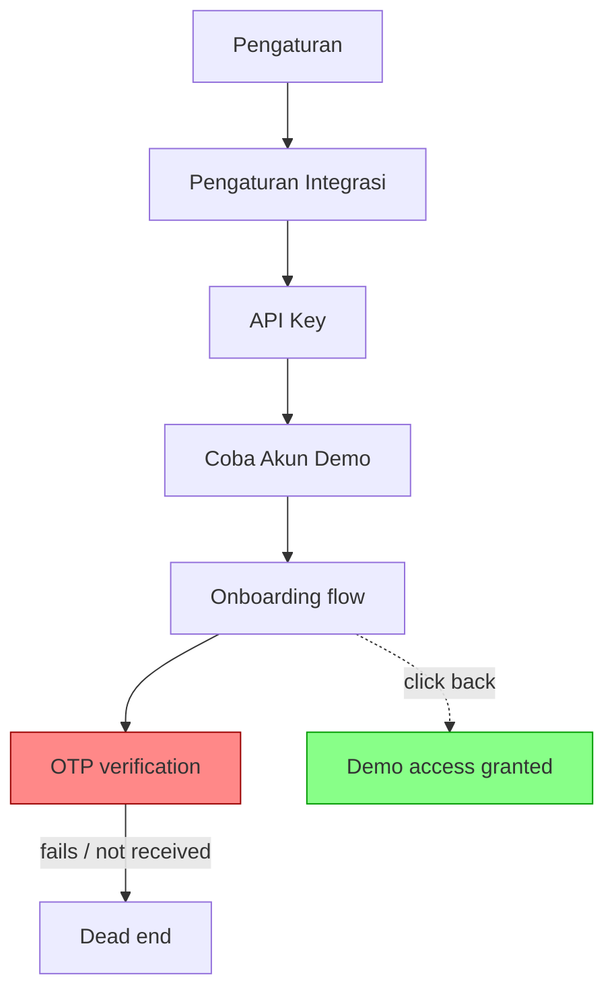
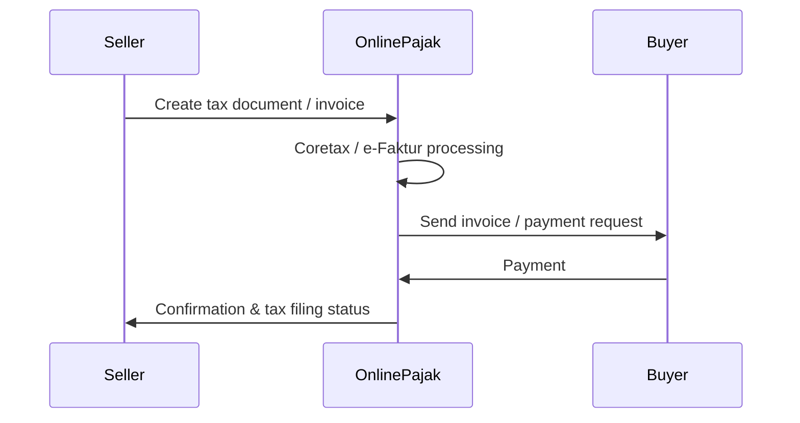
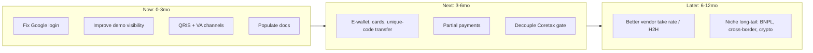

# Achilles (OnlinePajak)
### Strategy for Growth in Onboarding and Payment

**by: Maulanna Maryunani**

---

## Executive Summary

- Existing system's analysis is based on walking through Achilles platform's onboarding flow up until attempted invoice creation
- Found friction points on:
  - payment channel coverage,
  - dashboard UI reliability,
  - API docs
- Proposed "what success looks like" (inc. narrative and metrics)
- Proposed a prioritized mini-roadmap with RICE scoring
- Closes with open questions and risks

{}
This document discusses the problems within payment channel coverage, dashboard UI reliability, and support and API docs issues found while walking through the existing Achilles platform and capabilities from onboarding up to invoice creation (attempts).

It attempts to define success in phases of time horizons, focusing on improved onboarding flows and more payment channels/methods, to increase transaction numbers and eventually OnlinePajak/Achilles' monetization and take rate of transactions.

It also proposes a mini-roadmap consisting of a prioritized "laundry-list" of initiatives, and proposes some hypotheses and methods of experimentation relating to the roadmap.

Finally, it addresses the open questions and risks from following this document, as it's purely done from an external's perspective.
{}

---

## Problem & Opportunity Framing

- I walked through Achilles onboarding (registration → registered user) and invoice creation flow
  - _caveat: I did not complete Coretax passphrase verification, so I couldn't create invoice in production_
- Exploration surfaced **friction for users** to getting to have paid invoices:
  - Payment Channel coverage
  - Dashboard UI reliability
  - API documentation issues

{}
Note:
To understand the existing Achilles platform and capabilities, I walked through the Achilles onboarding flow (registration up until becoming a registered user) and payment creation flow. (Caveat: I didn't manage to do the Coretax passphrase verification and mapping.)

This document highlights three categories: Payment Channel coverage, Dashboard UI reliability, and API documentation issues. These issues add friction to users looking to have a completed transaction and paid invoices.
{}

---

## Payment Channel Coverage
(1 of 2)

- Channels available: **cards and VA only**
  — below table stakes compared to a payment aggregator platform
  - discourage invoice completion within the platform
- Missing features:
  - payment via fee-free bank transfer,
  - payment via QRIS,
  - bulk/partial supplier payment support

{}
Note:
It is understood that Achilles/OnlinePajak has a more tax-compliance-focused message vs. other payment players, but not having coverage in payment channels can discourage invoice completion within the platform, and will eventually defeat the "tax compliance with convenience" message.

{}

---

## Payment Channel Coverage 
(2 of 2)

- Creating a payment is gated behind Coretax passphrase verification
  - (expected from a tax compliance POV, but adds friction for users trying the product out)
  - propose to explore a compliant way of completing _at least one_ invoice creation before passphrase verification
  - another way: make it easier to explore **demo environment** (will discuss later)

{}
While it is expected that some limitation appears before verification, my point of view is that it's important for a (prospective) user to be able to experience the whole flow, even if only in the demo environment (currently buried in the settings page and requiring a second registration). This is especially true for the long-tail SME market, which probably has document completeness as a more potent friction point.
{}

---

## Dashboard UI Reliability

- Demo environment buried in navigation + broken onboarding flow
- Breaking "Login with Google" if using app.online-pajak.com domain
- Empty support pages (support.achilles.id)
  - practically all articles not have any content

{}
Note:
I ran into an empty support page (https://support.achilles.id/, all articles rendered "Belum ada konten"), Google OAuth failing on a domain redirect bug between online-pajak.com and app.achilles.id, and breakage in demo environment onboarding plus its lacking visibility. Details on each follow in the next two slides.
{}

---

## Dashboard UI Reliability 
(1 of 3) Demo environment buried in navigation + broken onboarding flow

- Not surfaced in primary navigation — buried three levels deep in Settings
  - Peer payment-focused products (Xendit, DanaraPay) make Demo Mode highly visible
- OTP verification (email/phone) breaks (no way to onboard)
  - Workaround: clicking "back" during onboarding grants demo access _without being logged in_ (hacky? lucky?)

[(kinda hope you haven't fixed it)Let me show you:](https://app.achilles.id/global-settings/settings/manage-api-keys)

{}
Note:
I ran into an empty support page (https://support.achilles.id/, all articles rendered "Belum ada konten"), Google OAuth failing on a domain redirect bug between online-pajak.com and app.achilles.id, and breakage in demo environment onboarding plus its lacking visibility. Details on each follow in the next two slides.
{}

---

## OAuth Domain Redirect Bug

{}
Note:
Google sign-in on app.online-pajak.com completes the OAuth handshake but then redirects back to the login page instead of into the app; users need to navigate directly to app.achilles.id/home to land on the authenticated dashboard. This will be significant for users who only remember the dashboard as "OnlinePajak" and not "Achilles."
{}

---

## Demo Environment Friction

- Not surfaced in primary navigation — buried three levels deep in Settings
- Peer products (DanaraPay, Xendit) make Demo Mode highly visible
- Demo onboarding breaks on OTP verification (email/phone)
- Workaround: clicking "back" during onboarding grants demo access
- Current path relies on luck, not design

{}
Note:
First, the demo isn't surfaced anywhere in primary navigation but instead in Pengaturan → Pengaturan Integrasi → API Key → "Coba Akun Demo." This dramatically reduces conversion of users wanting to see the value of the service. In similar services to OnlinePajak/Achilles — DanaraPay and Xendit, though both are more focused on payment aggregation without emphasis on tax compliance — it's table stakes to have Demo Mode highly visible.

Secondly, clicking through goes through an onboarding flow which breaks because it needs OTP verification through email and phone, which may or may not have been implemented in demo (I personally haven't been able to receive OTP in demo). Demo can actually be accessed if one clicks "back" on onboarding, but it should have been easier — I personally was able to access the demo by pure luck.
{}

---

## API Documentation: Tax Compliance Strength

- developer.achilles.id is a serviceable source for tax-compliance integrations
- Real Getting Started guide: API keys (sandbox/prod), webhooks, CTAS/Coretax signatory setup
- Spans Transaction, Document, Tax Payment & Filing, DataServices, Payroll, Print & Delivery
- Sequence diagrams show flow between Seller, OnlinePajak, and Buyer
- More complete than Mekari KlikPajak's narrower e-Faktur/e-Bupot/e-Billing surface

{}
Note:
Achilles's public developer docs (developer.achilles.id) are already a serviceable source for integrations aiming for better tax-compliance integration. In my opinion it is a more complete API documentation than Mekari KlikPajak, another platform with tax compliance objectives.

Mekari Klikpajak's API docs cover a narrower e-Faktur/e-Bupot/e-Billing/NPWP-validation surface with no comparable getting-started walkthrough.
{}

---

## API Documentation: Payment Gaps

- Xendit's payment API docs: broader channels (VA, QRIS, cards, e-wallet), bulk + UI/no-UI checkouts, refunds/returns covered
- Achilles docs: one payment endpoint, leads to a waitlist (unclear if live)
- No documented endpoint for refunds or channel-specific parameters
- Until this gap closes, payment collection likely stays off-product

{}
Note:
Payment and checkout still has gaps especially when compared to a payments-first platform like Xendit. Xendit Payment API docs have broader channels (VA, QRIS, cards, e-wallet, in single transaction and bulk, with and without UI payment checkouts), and also cover more edge cases (refunds/returns).

OnlinePajak/Achilles's API docs currently only have one payment endpoint which eventually leads to a waitlist (unconfirmed if the API has already gone live). No documented endpoint for refunds and channel-specific parameters.

Until this gap to a payments-first platform is closed, it's reasonable to assume payment collections will need to be off-product, which reduces quality of data and creates friction to the supposed ease of tax compliance as well.
{}

---

## What Success Looks Like

- Success defined by narrative + key metrics, per time horizon
- **Now** (0–3 months), **Next** (3–6 months), **Later** (6–12 months)
- Horizon splits are ballpark estimates based on rough effort

{}
Note:
To decide what to improve in the Achilles platform, this document defines what success looks like, providing narrative and key metrics, divided by rough time horizon phases (Now, Next, or Later). Division of Now/Next/Later narratives are based on ballpark estimates of which milestones can come earlier (by rough effort estimation).
{}

---

## Success: Now (0–3 months)

- Improved onboarding flows and documentation
- Conversion of self-onboarded merchants to first invoice creation
- Start adding payment channels for sales invoices
- Experiments to improve paid invoices rate

{}
Note:
Key metrics: onboard completion rate; dashboard engagement (login rate, monthly/weekly/daily active) per user; rate of onboarded users to invoice created rate; paid invoices rate; invoices created-to-paid within system rate.
{}

---

## Success: Next (3–6 months)

- Payment flow (dashboard + APIs), channels, and options match payment-industry norms
- Growing number of sales invoice creations and payment completions

{}
Note:
Key metrics: rate of onboarded users to invoice created rate; paid invoices rate; invoices created-to-paid within system rate; payment channel mix (VA vs. card vs. QRIS).
{}

---

## Success: Later (6–12 months)

- Experiment with niche long-tail payment options (BNPL, cross-border)
- Growing take rate of invoice payments via better vendor pricing

{}
Note:
Key metrics: all metrics discussed in the previous phases, plus take rate per completed transaction; payment channel utilization especially niche channels (BNPL, cross-border); number of "in-system buyers" per client.
{}

---

## Mini-Roadmap

- Laundry list of initiatives generated pre-prioritization
- Then run through a prioritization process (RICE, for this exercise)
- Now/Next/Later horizon can shift once RICE scoring is applied

{}
Note:
To achieve each narrative of success, these initiatives are proposed, with a "laundry list" of initiatives generated pre-prioritization, then going through a prioritization process (for the purposes of this exercise, RICE).
{}

---

## Laundry List: Now (0–3 months)

- Fix Google login failure on OnlinePajak domain
- Improve sandbox/demo visibility; remove re-onboarding after prod onboarding
- New payment channels via aggregator: QRIS, VA/bank transfer
- Populate docs: support docs + API docs (payment section)

{}
Note:
Rationale & metrics moved:
- Google login fix → dashboard engagement (login rate)
- Demo visibility → rate of onboarded users to invoice created rate
- New payment channels → paid invoices rate; invoices created-to-paid within system rate
- Docs → rate of onboarded users to invoice created rate; support ticket volume tagged to onboarding and invoice creation

{}

---

## Laundry List: Next (3–6 months)

- New payment channels: e-wallet, cards, bank transfer via unique code (reduce VA dependency)
- Support partial end-user payments, opt-in per invoice (unclear if already supported)
- Decouple payment from Coretax passphrase certificate gate, where compliance allows

{}
Note:
Rationale & metrics moved:
- New payment channels → paid invoices rate; invoices created-to-paid within system rate; payment channel mix
- Partial payments → paid invoices rate; invoices created-to-paid within system rate
- Decouple Coretax gate → dashboard engagement (login rate, MAU/WAU/DAU) per user; rate of onboarded users to invoice created rate

{}

---

## Laundry List: Later (6–12 months)

- Better vendor integrations/relationships for improved take rate
- Migrate from payment aggregator integrations to H2H for VAs
- Negotiate better take rate from QRIS vendors
- Explore niche long-tail payment options: BNPL, cross-border, crypto

{}
Note:
Rationale & metrics moved:
- Vendor integrations / H2H / QRIS negotiation → take rate per completed transaction
- Niche long-tail options (BNPL - Shopee PayLater, GoPayLater, Kredivo/Home Credit/etc.; cross-border payments; crypto) → invoices created-to-paid within system rate; take rate per completed transaction; payment channel utilization especially niche channels; number of in-system buyers per client
{}

---

## Prioritization: RICE

- RICE = Reach × Impact × Confidence ÷ Effort
- **Reach**: % of business impacted (e.g., Google Login fix reaches ~35% of users still on old domain using Google login)
- **Impact**: 3 = massive, 2 = big, 1 = medium, 0.5 = small, 0.25 = very small
- **Confidence**: how accurate the R/I/E estimates are
- **Effort**: 0.5 = no dev needed → 2 = internal + external integration dev

{}
Note:
Providing prioritization for a laundry list can use multiple tools. For sake of simplicity, this document uses the RICE method. This provides further validation and rigor into prioritization and timelining of each feature request in the laundry list — in effect, the Now/Next/Later horizon of every item can still change based on this RICE scoring.

Example: the Google Login initiative assumes that 35% of the whole OnlinePajak/Achilles user base still uses the onlinepajak domain AND uses Google login, and has a massive impact score because without the fix that 35% wouldn't be able to access the dashboard at all.

{}

---

## RICE Scores: Now-tier Items

| Initiative | Reach | Impact | Conf. | Effort | RICE | Verdict |
|---|---|---|---|---|---|---|
| Fix Google login failure | 35% | 3 | 60% | 1 | 0.63 | Now |
| Improve demo visibility | 100% | 1 | 90% | 1 | 0.90 | Now |
| New channel: QRIS | 100% | 2 | 90% | 2 | 0.90 | Now |
| Populate API docs (payment) | 50% | 1 | 70% | 0.5 | 0.70 | Now |
| Decouple Coretax gate | 90% | 2 | 50% | 1.5 | 0.60 | Now |

---

## RICE Scores: Next-tier Items

| Initiative | Reach | Impact | Conf. | Effort | RICE | Verdict |
|---|---|---|---|---|---|---|
| More banks in VA/bank transfer | 100% | 0.5 | 90% | 2 | 0.23 | Next |
| Populate support docs | 40% | 1 | 70% | 0.5 | 0.56 | Next |
| New channel: E-wallet | 100% | 1 | 70% | 2 | 0.35 | Next |
| Bank transfer via unique code | 100% | 0.5 | 70% | 1.5 | 0.23 | Next |
| Negotiate better QRIS take rate | 30% | 2 | 100% | 2 | 0.30 | Next |

---

## RICE Scores: Later-tier Items

| Initiative | Reach | Impact | Conf. | Effort | RICE | Verdict |
|---|---|---|---|---|---|---|
| Cards (not covered by VISA) | 100% | 0.25 | 70% | 2 | 0.09 | Later |
| Partial end-user payments | 100% | 0.25 | 70% | 1.5 | 0.12 | Later |
| Migrate to H2H for VAs | 20% | 1 | 100% | 2 | 0.10 | Later |
| BNPL (Shopee PayLater, GoPayLater, etc.) | 50% | 1 | 50% | 2 | 0.13 | Later |
| Cross-border payments | 5% | 1 | 50% | 2 | 0.01 | Later |
| Crypto payments | 3% | 1 | 50% | 2 | 0.01 | Later |

---

## Sample Experiments

- Two experiments proposed to validate roadmap hypotheses
- Experiment 1: Removing the Coretax Passphrase Verification gate
- Experiment 2: Enable Bank Transfer via Unique Code

---

## Experiment 1: Remove Coretax Passphrase Gate

- **Hypothesis**: Removing/deferring the e-Faktur certificate verification gate from the payment flow increases invoice creation rate
- **Method**: A/B test — route a subset of onboarded users through a streamlined flow that defers certificate verification until after invoice creation
- **Success threshold**: at least 15% relative lift in invoice creation rate for the test group, with no increase in downstream compliance exceptions

---

## Experiment 2: Bank Transfer via Unique Code

- **Hypothesis**: A fee-free "transfer with unique code" option increases payment volume among SME/long-tail customers who default to bank transfer over card or VA
- **Method**: Segmented/whitelisted rollout — enable fee-free bank transfer for a cohort of SME accounts (by NPWP segment), matched control cohort on current VA/card-only flow, compared over 6–8 weeks
- **Success threshold**: at least 20% of the test cohort's payment volume shifts to bank transfer, with no net drop in total payment volume or take rate

---

## Risks & Open Questions

- **Company strategy risk**: does a payments-heavy roadmap fit OnlinePajak's broader "break through" payments strategy?
- **Compliance risk**: could initiatives (e.g. pre-verification invoicing) harm standing with DJP/regulators? (critical)
- **Technical/resource risk**: are resources and stacks (e.g. PCI-DSS for cards) already available?
- **Branding/positioning risk**: does an "all-in-one" push dilute the core tax-compliance USP?

{}
Note:
It is understood that this document presents initiatives that have not yet been aligned with any internal context in OnlinePajak/Achilles; there is therefore an expectation of major risks and open questions borne out of assumptions, listed here.

Company Strategy risk: We have established that OnlinePajak both (1) comes from a tax compliance USP and (2) is trying to have a natural extension into the payments product. This roadmap is admittedly payments-heavy since it is where I have most of my context from. Does this fit the overall strategy to "break through" the payments software cohort?

Compliance risk: Some initiatives listed here may cut into the tax compliance part (e.g. experimenting with creating invoices before Coretax passphrase verification). Need to make sure this does not contribute negatively to OnlinePajak/Achilles' standing with DJP and other regulators — critical.

Technical and resource risk: Need to confirm that resources for doing the initiatives are available and if some stacks (example: PCI-DSS for card payment channels) are already there technically; if not, timelining will need to be tweaked.

Branding/positioning risk: The initiatives listed here do not have improvements or iterations within the tax compliance perspective (current OnlinePajak USP). While this fits the strategy for OnlinePajak/Achilles to be an "all-in-one" business platform, would there be a risk within current branding/positioning in the market that the initial USP is diluted?
{}

---

## Appendix + References

- Full friction audit in the OnlinePajak/Achilles dashboard flow (15 items, tested by Claude AI): https://docs.google.com/document/d/12DxH7dQAMiKOFI9N4CU7GVJz_lxHZTX2uBXSe1BHcNI/edit
- Full Mekari competitive/API profile (generated via Claude AI): https://docs.google.com/document/d/1fXiBARn3sIG69IFAaGRFcM5g4h6L8hqCJlP2TDzB_Eg/edit
- Achilles Open API Docs: developer.achilles.id
- Klikpajak Public API v1 (Postman)
- Xendit API Reference: developers.xendit.co
- Mekari Pay / Jurnal Payment API: developer.jurnal.id

{}

Note:
Full reference links:
- OnlinePajak/Achilles Dashboard: https://app.onlinepajak.com
- Achilles Open API Docs: https://developer.achilles.id/docs/api-documentation/187d54910ee5b-single-creation
- Klikpajak Public API v1 (Postman): https://documenter.getpostman.com/view/17365057/U16hrR5d
- Xendit API Reference: https://developers.xendit.co/api-reference/
- Mekari Pay / Jurnal Payment API: https://developer.jurnal.id/
- RICE Prioritization Framework (Intercom): https://www.intercom.com/blog/rice-simple-prioritization-for-product-managers/
- RICE Scoring Model (ProductPlan): https://www.productplan.com/glossary/rice-scoring-model/
{}

---

<!-- Add this at the bottom of index.md -->

