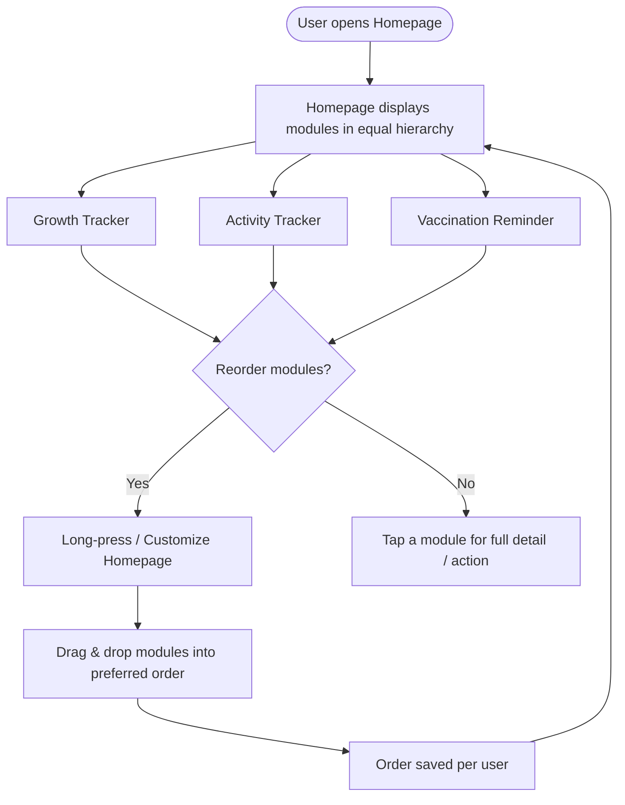

---

title: "Tentang Anak Homepage Revamp — Product Requirements Document"
subtitle: "Driving Engagement Without Sacrificing Simplicity"
summary: "PRD for the next iteration of the Tentang Anak Homepage"
authors: ["Maulanna Maryunani"]
tags: [case study]
categories: []
date: 2026-07-22
type: slides
slides:
  theme: white
  highlight_style: github
  
---

<!-- ============================================================
SLIDE STRUCTURE — Tentang Anak Homepage Revamp PRD
"---" separates horizontal (top-level) slides.
"***" separates vertical (nested) sub-slides within a section.
Verify these separators match your HugoBlox/reveal.js config —
some versions default to different symbols.
============================================================= -->

# Tentang Anak Case Study
### Tentang Anak App Homepage Revamp

by Maulanna Maryunani

---

## Background & Context
 
- In **August 2025**, the Product team launched a major Homepage redesign
- In the redesign, the **Baby Tracker** (one of the most-used features) became the primary homepage focus, and most feature shortcuts were moved behind a dedicated **Menu page**.
 
_Immediately after launch, homepage drop-off improved and DAU/WAU stayed stable. Over the following months, however, **MAU declined** and **new installs continued to decrease**. Leadership expected engagement and growth to improve — those expectations were not met. Leadership now wants Product to determine **what should be improved next**._

---

## What the Data Shows

 
| Quantitative (last 6 months) | Qualitative research |
| :--- | :--- |
| • Homepage drop-off: **26% → 18%** after redesign | • Homepage feels "cleaner" but "less useful" |
| • DAU stable at **~15,000**/day; WAU stable at **~62,000**/week | • Some parents struggle to find important features |
| • MAU declined **145,000 → 123,000** | • Growth Tracking (Fitur Tumbuh), a core value proposition, is now harder to access |
| • Monthly installs declined **19,000 → 14,500** | • Many users are unaware of features hidden behind the Menu page |
 
*Note: the team has **not** concluded that homepage discoverability is the root cause of the declining metrics. Before/after homepage screenshots are provided separately.*

---

## Problem Statement

**Prioritizing Baby Tracker squeezes out non-daily/weekly features**
- **Baby Tracker** is a daily-cadence habitual activity (tracking naps, feeds, diapers)
- Prioritizing it leaves little homepage real estate for monthly-cadence features (Growth Tracking, vaccination reminders)
  -   This lines up with data: **DAU/WAU stable**, but **MAU declined**
  -   _Hypothesis_: MAU decrease --> less usage, less community referrals/word of mouth --> decrease in new installs
  -   This lines up with qualitative feedback: "app looks cleaner but feels less useful"

---

## Product Goal & Success Metrics
 
**Goal:** Recover MAU and install growth by restoring homepage visibility for non-daily-cadence features (Growth Tracking + Vaccination reminders)
 
- **Primary metrics**
  - MAU: trend back toward pre-redesign baseline (~145,000)
  - Monthly installs: trend back toward pre-redesign baseline (~19,000/month)
 
- **Guardrail metrics**
  - Homepage drop-off must not rise again to pre-redesign (**26%**), stretch goal: stays at **18%**
  - DAU (~15,000/day) and WAU (~62,000/week) must not rise again to pre-redesign, stretch goal: hold flat.

- **Supporting metrics**
  - % of MAU engaging with Growth Tracking or vaccination reminders at least once a month (feature breadth)
  - Tap-through concentration: share of homepage taps landing on the single primary CTA vs. spread across other elements

---
## Target User Personas
 
**Primary — "periodic check-in" parents:** parents w/ children due for a monthly-ish touchpoint (growth measurement, vaccination) 
 
**Secondary — existing "daily" Baby Trackers** — already well-served by the current homepage; need to try to not make their engagement worse
 
**Out of scope this iteration:** pregnant/Kehamilan-tab users — a distinct persona with different homepage needs. Candidate for a future iteration

---

## Opportunity Assessment

(Why Solve This First)

<!-- Why this bet, over other plausible bets, given the constraints -->

**Why this bet first:**
- Only hypothesis consistent with all four data points at once: DAU/WAU stable (daily habit intact) + MAU declining (monthly-cadence usage eroding) + installs declining (plausible referral/word-of-mouth spillover from that same eroding cohort)
- Direct evidence: quali research names Fitur Tumbuh (Growth Tracking) explicitly as a "core value proposition" that's now "harder to access"
- Protects what's already working — doesn't touch Baby Tracker, so the DAU/WAU and drop-off gains already banked aren't put at risk
- Fast to ship and validate — should fit resource constraints and have time to A/B test and get signals

**Why not other bets first:**
- Full Menu redesign — bigger effort accross domains
- Cleaning up homepage (get rid of some CTAs) — higher risk of alienating current baby tracking power users

---

## Scope & Proposed Solution

---

### In Scope

- **Promote Growth Tracker out of the "Gizi baik" pill** — give it its own properly-sized module (comparable visual weight to the Baby Tracker sub-cards)
- **Bring Vaccination reminder above the fold** — it already exists on Beranda but currently requires scrolling to reach; reposition so it's visible without scrolling
- **User-controlled module reordering** — let users reorder four homepage modules (Growth Tracker, Pencapaian, Baby Tracker, Vaccination reminder) via drag-and-drop or a simple reorder setting
  - Persist each user's chosen order (need BE but small effort)
  - Track reorder actions and engagement per module by position

---

### Out of Scope

- Menu redesign
- Nav bar changes
- Any other major BE architecture
- Algorithmic/ML-based auto-reordering
- Changes to the Baby Tracker widget's own internal functionality

---

### Proposed Solution

- **Growth Tracker module:** replace the small green "Gizi baik" pill with a full module card
  — latest weight/height/nutrition status plus a clear CTA into the full Growth Tracker, sized on par with the daily tracker cards
- **Vaccination module:** keep existing content, move it up so it renders above the scroll fold
- **Reorder capability:** long-press or a lightweight "customize homepage" entry point lets a user drag Growth Tracker, Pencapaian, Baby Tracker, and Vaccination reminder into their preferred order;
  - saved per user, order retained on following visits

---

## High-Level User Flow
 

---

## Functional Requirements & Edge Cases

***

### Functional Requirements

<!-- What the system must do -->

***

### Edge Cases

<!-- Where it could break, and how it's handled -->

---

## Rollout Strategy, Risks & Trade-offs

***

### Rollout Strategy

<!-- Phasing, experiment design, success gates -->

***

### Risks

<!-- What could go wrong -->

***

### Trade-offs

<!-- What's explicitly given up by choosing this scope -->

---

<!-- Add this at the bottom of index.md -->

